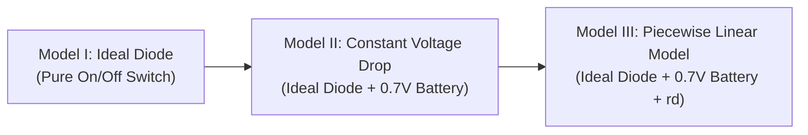

# Lecture 2: Diode Physics, Equivalent Circuit Modeling, Load Line Analysis & DC Circuits

**Course:** ETRN2 – Electronics 2  
**Topic:** Diode Materials (Si vs. Ge), Saturation Current & Thermal Voltage, Zener Breakdown Terminology, Dynamic/Static Resistance, Equivalent Circuit Models (I, II, III), Load Line Analysis, DC Worked Examples, and Professor Tangents/Exam Tips  
**File Path:** `/Users/francis/school/y2/t3/etrn2/lecs/transcriptions/notes/lec2_notes.md`

---

## 1. Diode Base Materials & Physical Characteristics

Diodes are the simplest semiconductor devices, consisting of two differently doped ($P$-type and $N$-type) base materials joined to form a $PN$ junction. Fabrication-wise, they are as simple as semiconductor manufacturing gets, making them the lowest-cost semiconductor components available.

### 1.1 Germanium (Ge) vs. Silicon (Si) Comparison

While other semiconductor materials exist, **Germanium (Ge)** and **Silicon (Si)** are the primary commercially viable elements due to low raw material costs.

| Parameter / Feature | Germanium (Ge) Diodes | Silicon (Si) Diodes |
| :--- | :--- | :--- |
| **Forward Conduction Threshold ($V_F$)** | Begins conducting as early as **$0.1\text{ V}$**; typical operating range **$0.3\text{ V} - 0.4\text{ V}$** | Begins conducting around **$0.5\text{ V}$**; typical operating range **$0.6\text{ V} - 0.7\text{ V}$** (up to **$0.8\text{ V}$** at higher currents) |
| **Signal Loss / Degradation** | Minimal voltage drop preserves small-signal amplitudes | Higher voltage drop chomps off a larger portion of low-amplitude signals |
| **Primary Applications** | Low-level small-signal rectification, precision RF/signal processing | General-purpose rectification, power electronics, digital logic switching |
| **Market Selection & Availability** | Selection is very small (only 1 or 2 popular part types, e.g., 1N34A). Slightly more expensive due to low demand/volume, but still very low cost | Ubiquitous industry standard, mass-produced, extremely inexpensive |

> [!NOTE]
> **Component Sourcing & Local Lab Note:**  
> The selection of Germanium diodes is limited today, but standard electronics stores stock them. For instance, at **eGizmo** (the electronics store next door to the **Cox Building**), Germanium diodes are readily available. Though low-demand pricing makes Ge slightly more expensive than Si, both sell at resistor-like bargain price levels.

---

## 2. Diode Mathematical Parameters & Key Definitions

### 2.1 Thermal Voltage ($V_T$)
The thermal voltage $V_T$ is calculated using Boltzmann's equation:

$$V_T = \frac{k \cdot T}{q}$$

Where:
- $k = 1.38 \times 10^{-23}\text{ J/K}$ (Boltzmann's constant)
- $T = \text{Absolute temperature in Kelvin } (K = {^\circ}\text{C} + 273.15)$
- $q = 1.6 \times 10^{-19}\text{ C}$ (Magnitude of electron charge)

**Standard Values to Remember:**
- At $20^\circ\text{C}$ ($293.15\text{ K}$): $V_T \approx 25.26\text{ mV}$
- At $25^\circ\text{C}$ ($298.15\text{ K}$, room temperature): 

$$V_T \approx 25.85\text{ mV} \approx 26\text{ mV}$$

> [!IMPORTANT]
> **Professor's Tip:** Memorize **$26\text{ mV}$** at $25^\circ\text{C}$. This figure reappears constantly in diode AC resistance formulas, small-signal models, and transistor equations (e.g., BJT $r_e = \frac{26\text{ mV}}{I_E}$). Keep it in mind so you don't wonder where it comes from!

### 2.2 Reverse Saturation Current ($I_S$)
Reverse saturation current $I_S$ flows through a reverse-biased diode prior to breakdown:
- Dictated by material doping concentrations ($N_1, N_2$), junction area, and intrinsic carrier concentration.
- At room temperature:
  - Silicon: $I_S \approx 10^{-15}\text{ A}$ ($1\text{ fA}$) to $10^{-12}\text{ A}$ ($1\text{ pA}$)
  - Germanium: $I_S \approx 10^{-9}\text{ A}$ ($1\text{ nA}$)
- Governs the initial reverse current before reaching reverse breakdown. Highly temperature dependent.

### 2.3 Breakdown Region & Zener Knee Voltage Notation ($V_{ZK}$)
- **Breakdown Voltage:** The sharp potential where reverse potential forces heavy reverse conduction.
- **$V_{ZK}$ Abbreviation:** The subscript **$K$ stands for "Knee"** ($V_{ZK} =$ **Zener Knee Voltage**), representing the sharp bend ("knee") on the $I-V$ characteristic curve.
- Specially manufactured **Zener diodes** control this knee voltage to occur at lower potentials for voltage regulation.

---

## 3. Dynamic, Static, and Average AC Resistance Models

Because the forward conduction curve is non-linear (exponential), a diode does not possess a single constant resistance value.

### 3.1 Static / DC Resistance ($R_D$)
Calculated at a specific static operating point:

$$R_D = \frac{V_D}{I_D}$$

**Numerical Illustration from Diode $I-V$ Curve:**
1. **Low Current Operating Point ($I_D = 2\text{ mA}, V_D = 0.5\text{ V}$):**
   $$R_D = \frac{0.5\text{ V}}{2\text{ mA}} = 250\,\Omega$$
2. **High Current Operating Point ($I_D = 20\text{ mA}, V_D = 0.8\text{ V}$):**
   $$R_D = \frac{0.8\text{ V}}{20\text{ mA}} = 40\,\Omega$$
3. **Reverse Bias Region ($V_D = -10\text{ V}, I_D = -1\,\mu\text{A}$):**
   $$R_D = \frac{-10\text{ V}}{-1\,\mu\text{A}} = 10\text{ M}\Omega \quad (\text{Essentially an open circuit})$$

*Conclusion:* $R_D$ drops significantly as forward current increases, proving strong non-linearity.

### 3.2 Dynamic / AC Resistance ($r_d$)
For dynamic small-signal AC variations around a DC Quiescent point (Q-point), dynamic resistance represents the tangent slope:

$$r_d = \frac{\Delta V_D}{\Delta I_D} \approx \frac{26\text{ mV}}{I_D} \quad (\text{at } 25^\circ\text{C})$$

> [!NOTE]
> **Professor's Commentary:**  
> The formula $r_d = \frac{26\text{ mV}}{I_D}$ is easy to compute, but the professor notes he personally avoids using it for high-accuracy manual approximations as it assumes ideal exponential fitting.

### 3.3 Average AC Resistance ($r_{av}$)
When an AC signal swings between two finite current limits $(I_{D1}, V_{D1})$ and $(I_{D2}, V_{D2})$, the secant line yields the average AC resistance:

$$r_{av} = \frac{\Delta V_D}{\Delta I_D} = \frac{V_{D2} - V_{D1}}{I_{D2} - I_{D1}}$$

> [!TIP]
> **Why learn these three resistance definitions?**  
> As the professor explicitly remarked: *"To be totally honest, it is good to know so that you know how to answer the questions in the quiz! Para lang maisagot ang tanong sa quiz."*

---

## 4. Diode Equivalent Circuit Models

To analyze circuits containing non-linear diodes, three equivalent models of increasing fidelity and complexity are employed:



### 4.1 Model I: Ideal Diode Model
- **Behavior:** Operates as a perfect automated switch.
  - **Forward Bias ($V_D \ge 0\text{ V}$):** Closed switch ($V_D = 0\text{ V}, R = 0\,\Omega$).
  - **Reverse Bias ($V_D < 0\text{ V}$):** Open switch ($I_D = 0\text{ A}, R = \infty$).
- **Use Case:** High-voltage systems where $0.7\text{ V}$ is negligible, or quick initial inspection.

### 4.2 Model II: Constant Voltage Drop (CVD) / Practical Silicon Model
- **Equivalent Circuit:** Ideal diode in series with an opposing $0.7\text{ V}$ DC source (for Si) or $0.3\text{ V}$ (for Ge).
- **Internal Mechanism:** The opposing $0.7\text{ V}$ barrier potential ensures the ideal diode inside sees $V_{ideal} = V_{terminal} - 0.7\text{ V}$. 
  - When $V_{terminal} < 0.7\text{ V}$, $V_{ideal} < 0\text{ V}$ (diode remains open).
  - When $V_{terminal} \ge 0.7\text{ V}$, $V_{ideal} \ge 0\text{ V}$ (diode conducts with a fixed $0.7\text{ V}$ drop).
- **Use Case:** Standard manual DC and AC circuit analysis.

### 4.3 Model III: Simplified Piecewise Linear Model
- **Equivalent Circuit:** Ideal diode + barrier potential ($0.6\text{ V} - 0.7\text{ V}$) + dynamic series resistance $R_D$.
- **Effect:** Resistance $R_D$ tilts the vertical conduction line, providing the closest linear approximation to the exponential characteristic.
- **Use Case:** Precision signal calculations where current variations noticeably affect forward voltage drop. Requires a calculator to solve.

---

## 5. Load Line Analysis (Graphical Method)

Load Line Analysis solves interactive non-linear circuit equations graphically, bypassing complex transcendental exponential equations ($I_D = I_S (e^{V_D/V_T}-1)$).

### The "Chicken-and-Egg" Problem:
Writing KVL for a single-diode loop yields:

$$E - I \cdot R - V_D = 0 \implies I = \frac{E - V_D}{R}$$

Here, $I$ depends on $V_D$, but $V_D$ is non-linearly determined by $I$. 

### Steps to Construct a Load Line:
1. **Find Maximum Current Point ($I_{max}$ / Vertical Intercept):**  
   Assume diode is shorted ($V_D = 0\text{ V}$):
   
   $$I_{max} = \frac{E}{R}$$
   
   Plot point $(0\text{ V}, I_{max})$ on the y-axis.

2. **Find Maximum Voltage Point ($V_{max}$ / Horizontal Intercept):**  
   Assume diode is open ($I_D = 0\text{ A}$):
   
   $$V_{max} = E$$
   
   Plot point $(E, 0\text{ A})$ on the x-axis.

3. **Draw Load Line & Find Q-Point:**  
   Connect $(0\text{ V}, I_{max})$ and $(E, 0\text{ A})$ with a straight line. The intersection of this straight line with the diode's measured $I-V$ characteristic curve yields the exact **Quiescent Operating Point $(V_{DQ}, I_{DQ})$**.

---

## 6. Worked Numerical Examples & Classroom Derivations

### Example 1: Dual-Supply Series DC Circuit (Model II CVD Model)

**Circuit Configuration:**
- Positive Supply $E_1 = +10\text{ V}$
- Negative Supply $E_2 = -5\text{ V}$
- Resistors: $R_1 = 4.7\text{ k}\Omega$, $R_2 = 2.2\text{ k}\Omega$
- Silicon Diode (Model II, $V_D = 0.7\text{ V}$)

```
+10V o---[ R1 = 4.7k ]---(>| Si Diode )---+- - - o Vo
                                          |
                                   [ R2 = 2.2k ]
                                          |
                                        -5V
```

**Step-by-Step KVL Derivation:**

1. **Formulate Loop Equation (Clockwise Current $I$):**

   $$-E_1 + I \cdot R_1 + V_D + I \cdot R_2 + |E_2| = 0$$

   $$-10 + I(4.7\text{ k}\Omega) + 0.7 + I(2.2\text{ k}\Omega) - (-5) = 0$$

2. **Solve Net Driving Voltage ($V_{net}$) and Total Resistance ($R_T$):**
   - $V_{net} = 10 - (-5) - 0.7 = 14.3\text{ V}$
   - $R_T = 4.7\text{ k}\Omega + 2.2\text{ k}\Omega = 6.9\text{ k}\Omega$

3. **Calculate Loop Current ($I$):**

   $$I = \frac{14.3\text{ V}}{6.9\text{ k}\Omega} \approx 2.0725\text{ mA}$$

4. **Calculate Component Voltages:**
   - Voltage across $R_1$:  
     $$V_1 = I \cdot R_1 = 2.0725\text{ mA} \times 4.7\text{ k}\Omega = 9.74\text{ V}$$
   - Voltage across $R_2$:  
     $$V_2 = I \cdot R_2 = 2.0725\text{ mA} \times 2.2\text{ k}\Omega = 4.56\text{ V}$$

5. **Calculate Output Node Voltage ($V_o$ with respect to Ground):**
   - From negative rail upwards:  
     $$V_o = E_2 + V_2 = -5\text{ V} + 4.56\text{ V} = -0.44\text{ V}$$
   - From positive rail downwards (Verification):  
     $$V_o = E_1 - V_1 - V_D = 10\text{ V} - 9.74\text{ V} - 0.7\text{ V} = -0.44\text{ V}$$

---

### Example 2: Comparative Analysis Across Models ($E = 10\text{ V}, R = 1\text{ k}\Omega$)

Circuit setup: $E = 10\text{ V}$ DC source in series with $R = 1\text{ k}\Omega$ and a Silicon Diode.

#### Method A: Graphical Load Line Method
- $I_{max} = \frac{10\text{ V}}{1\text{ k}\Omega} = 10\text{ mA}$
- $V_{max} = 10\text{ V}$
- Reading intersection on graph (requires fine estimation / squinting):
  - $I_{DQ} \approx 9.25\text{ mA}$
  - $V_{DQ} \approx 0.78\text{ V}$
  - $V_R = 10\text{ V} - 0.78\text{ V} = 9.22\text{ V}$

#### Method B: Model II (CVD Model, $V_D = 0.7\text{ V}$)
- $V_R = 10\text{ V} - 0.7\text{ V} = 9.3\text{ V}$
- $I_D = \frac{9.3\text{ V}}{1\text{ k}\Omega} = 9.3\text{ mA}$

#### Method C: Model I (Ideal Diode, $V_D = 0\text{ V}$)
- $V_R = 10\text{ V}$
- $I_D = \frac{10\text{ V}}{1\text{ k}\Omega} = 10\text{ mA}$

**Model Comparison Summary Table:**

| Model / Method | Diode Voltage ($V_D$) | Resistor Voltage ($V_R$) | Circuit Current ($I_D$) |
| :--- | :--- | :--- | :--- |
| **Model I (Ideal)** | $0.0\text{ V}$ | $10.0\text{ V}$ | $10.0\text{ mA}$ |
| **Model II (CVD)** | $0.7\text{ V}$ | $9.3\text{ V}$ | $9.3\text{ mA}$ |
| **Load Line Analysis** | $0.78\text{ V}$ | $9.22\text{ V}$ | $9.25\text{ mA}$ |

---

### Example 3: Rapid Inspection / Reverse-Bias Check

**Circuit Concept (End-of-Lecture Preview Problem):**  
Circuit powered by a $12\text{ V}$ DC supply containing a reverse-biased diode $D_2$.

**Inspection Logic & Exact Solutions:**
1. Diode $D_2$ cathode is at higher potential than anode $\implies$ **Reverse Biased** (Open Circuit).
2. Because the branch is open ($I_D = 0\text{ A}$):
   - **$I_{D2} = 0\text{ A}$**
   - **$V_o = 0\text{ V}$** (no current through load resistor)
   - **$V_{D2} = -12\text{ V}$** (entire supply potential appears across reverse-biased diode $D_2$)

---

## 7. Professor Tangents, Student Questions, and Exam Tips

### 7.1 Professor Anecdotes & Class Side Comments
- **Font Rendering Issue:** During slide presentation on saturation current equations, the professor remarked on weirdly rendered equation fonts (*"I don't really know why the font is doing this..."*).
- **Electronics 1 Background Check:** During Example 1, the professor challenged the class to solve the series KVL without assistance (*"Galing kayong Citron 1 [Electronics 1]... mental challenge for you guys. If we were face to face and I gave a pop quiz right now, would everybody fail or are you just feeling lazy today?"*).
- **Student DM Correction:** When student Gabriel submitted an excessively large current value, the professor pointed out: *"It's kilo ohms and small voltages! Expect answers in mA, it can't be that big!"*
- **Graph Reading & Eyesight Jokes:** When explaining Load Line reading ($V_{DQ} = 0.78\text{ V}$): *"Squint as best as you can... small little eyes are at a major disadvantage! If you can see that's 0.78V, ang galing ng mga mata ninyo."*

### 7.2 Student Questions & Clarifications
- **Student Question (Diane / Payo):**  
  *Q: "Sir, when we're given a question like this, do we always assume silicon diode or is it given?"*  
  *A: Don't assume blindly! The problem will specify. Standard default for Silicon is $0.6\text{ V} - 0.7\text{ V}$; for Germanium it's $0.3\text{ V} - 0.4\text{ V}$. Quiz questions will explicitly state: 'Assume forward conduction voltage of...' or 'Assume Germanium diode operating at...'."*
- **Student Question (Exam Graph Scaling):**  
  *Q: "Will the graph be scaled if we're ever to answer this in an exam?"*  
  *A: "Of course! What kind of question is that? Mapraning kayo masyado (You guys are getting overly paranoid)."*

### 7.3 Crucial Exam & Terminology Distinctions
1. **$V_D$ vs. $V_F$ Terminology Warning:**
   - **$V_F$** refers specifically to the **Forward Voltage Drop** during conduction ($\approx 0.7\text{ V}$ for Si).
   - **$V_D$** refers to the **Terminal Voltage** across the diode generally. Under reverse bias, $V_D$ can be large and negative (e.g., $V_D = -10\text{ V}, -12\text{ V}, -20\text{ V}$). Do not confuse $V_D$ with forward voltage drop!
2. **Reverse State Priority:** Always check whether diodes are forward or reverse biased BEFORE carrying out loop numerical calculations.

---

## 8. Administrative & Laboratory Announcements

- **Next Lecture Class:** Scheduled for **Monday**.
- **Laboratory Class Notice:** Thursday lab section meets at **11:00 AM**. 
  - *"We are going to meet very briefly... face-to-face or online, we'll do the same thing anyway."*
